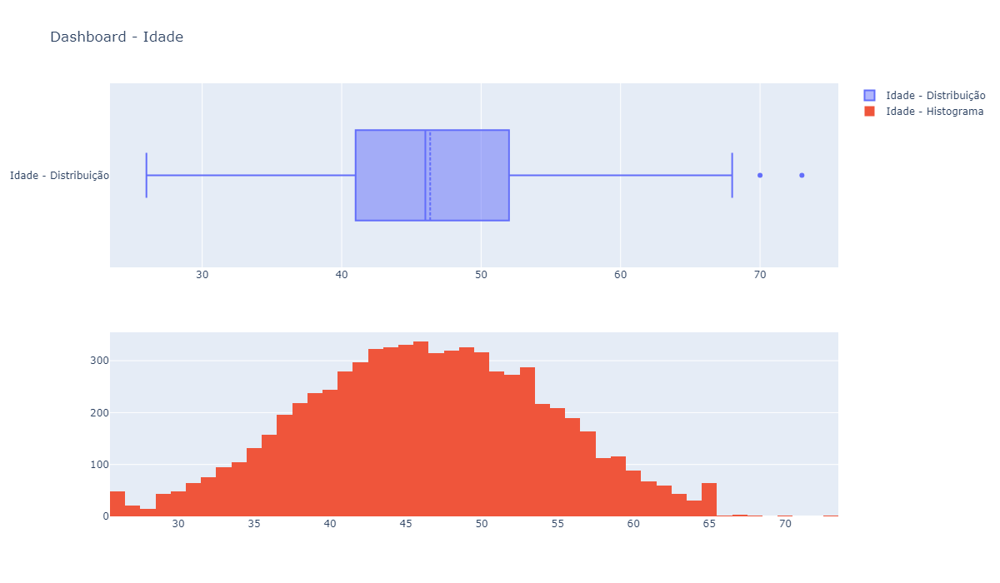
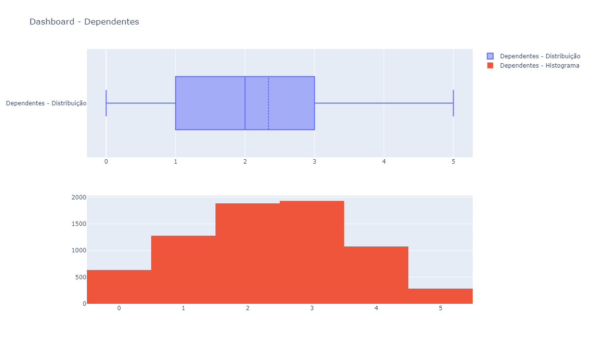
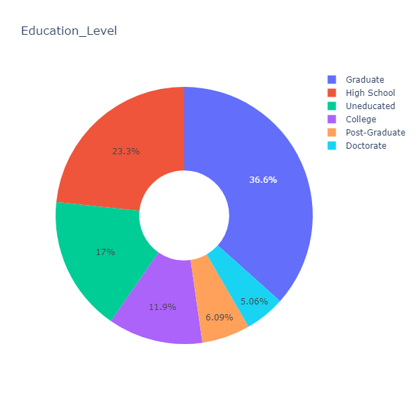
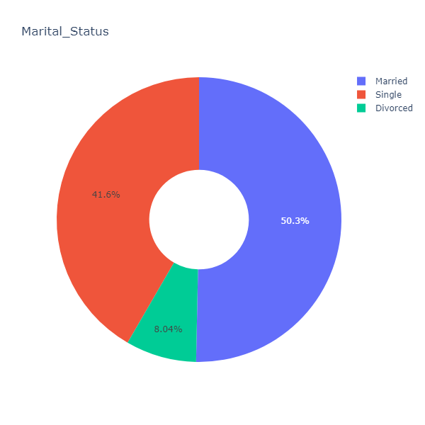
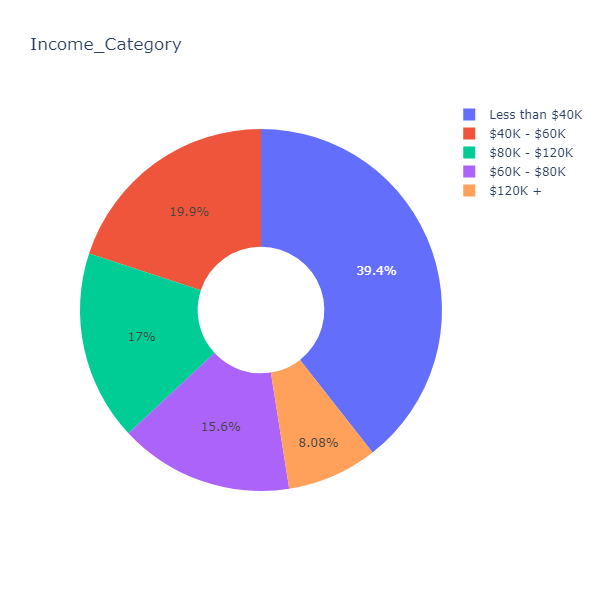
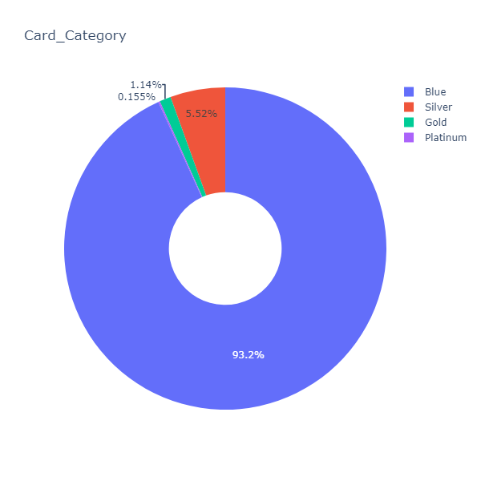
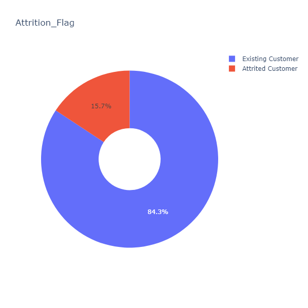
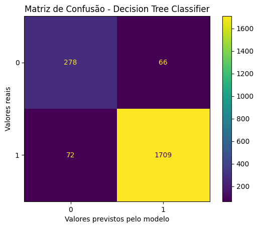
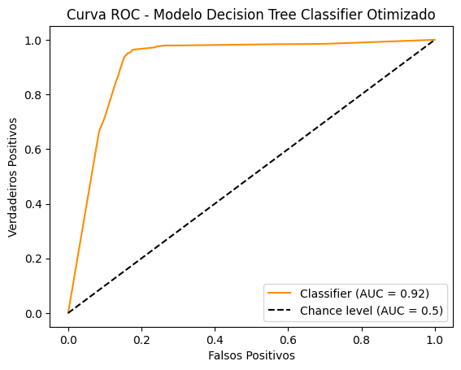
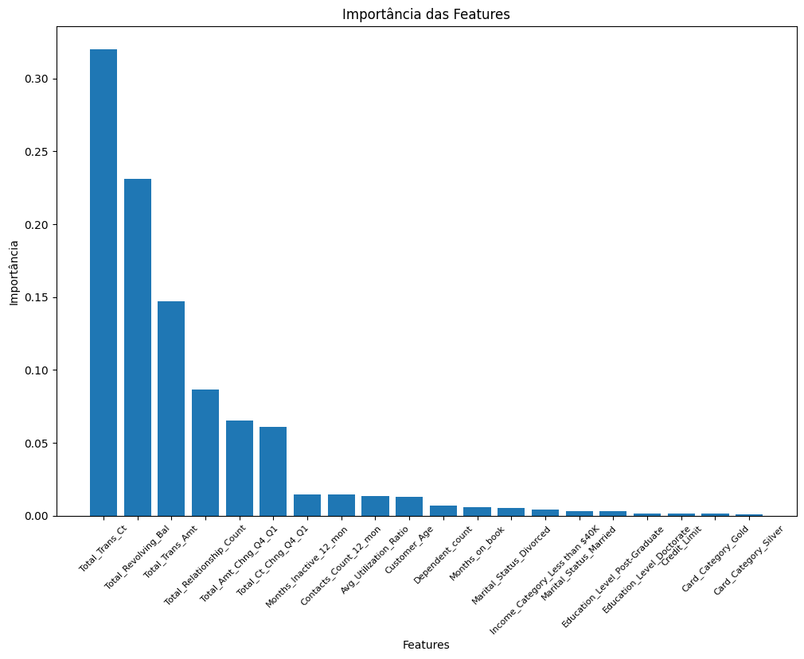

# Case - Definindo um modelo de machine learning para prever casos de churn em uma instuição financeira

## Introdução

Um gerente de um banco não está satisfeito com o fato de cada vez mais clientes abandonarem os serviços de cartão de crédito. Visando entender o que pode estar acontecendo e tentar prever quando um cliente se tornará churn, a instituição financeira disponibilizou um dataset com dados de todos seus clientes.

## Objetivo do projeto

Utilizando o dataset disponível, o objetivo do presente projeto é definir um modelo de machine learning para prever os casos de churn e identificar estratégias para evitar que isso com mais frequência.

## Sobre os dados

O dataset disponibilizado consiste em dados dos mais de 10.000 clientes, mencionando idade, salário, estado civil, limite do cartão de crédito, categoria do cartão de crédito, etc. Abaixo segue o descritivo de cada uma das colunas presentes na tabela de dados.

- CLIENTNUM: Identificador exclusivo do cliente titular da conta;
- Attrition_Flag: Variável de evento interno (atividade do cliente), nos diz se a conta do cliente foi encerrada ou não;
- Customer_Age: Idade do cliente;
- Gender: Gênero do cliente (masculino ou feminino);
- Dependent_count: Número de dependentes;
- Education_Level: Nível educacional;
- Marital_Status: Casado, Solteiro, Divorciado, Desconhecido;
- Income_Category: Renda anual;
- Card_Category: Tipo de Cartão (Azul, Prata, Ouro, Platina);
- Months_on_book: Período de relacionamento com banco;
- Total_Relationship_Count: Total de produtos detidos pelo cliente;
- Months_Inactive_12_mon: Nº de meses inativos nos últimos 12 meses;
- Contacts_Count_12_mon: Nº de contatos nos últimos 12 meses;
- Credit_Limit: Limite de crédito no cartão de crédito;
- Total_Revolving_Bal: Saldo Rotativo Total no Cartão de Crédito;
- Avg_Open_To_Buy: Linha de crédito aberta para compra (média dos últimos 12 meses);
- Total_Amt_Chng_Q4_Q1: Alteração no valor da transação (quarto trimestre em relação ao primeiro trimestre);
- Total_Trans_Amt: Valor total da transação (últimos 12 meses);
- Total_Trans_Ct: Contagem total de transações (últimos 12 meses);
- Total_Ct_Chng_Q4_Q1: Mudança na contagem de transações (quarto trimestre em relação ao primeiro trimestre);
- Avg_Utilization_Ratio: Taxa média de utilização do cartão.

## Bibliotecas utilizadas no desenvolvimento do projeto

Segue uma lista com as bibliotecas em Python utilizadas no desenvolvimento e resolução do case.

- pandas
- numpy
- matplotlib
- seaborn
- plotly
- sklearn

## Deployment

Para executar o projeto é necessário baixar o arquivo "case_churn_bancos.ipynb" (código do projeto) e o database "BankChurners.csv". Feito isso, salvar ambos os arquivos na mesma pasta e executar o código utilizando programas de visualização e leituras de códigos em jupyter notebook, como Visual Studio Code por exemplo, ou algum outro software similar.

Obs: para executar o código corretamente as bibliotecas listadas na sessão anterior precisam estar instaladas em sua máquina.

## Análise dos dados dos clientes

Após serem feitos os devidos tratamentos na base de dados disponível (exclusão de dados nulos, linhas duplicadas) foram analisadas a distribuição dos dados de algumas colunas presentes no dataset.

### Idade

Pelo gráfico acima percebe-se que a média de idade dos clientes é de 46.34, valor este muito próximo da mediana dos dados igual a 46. Outro aspecto importante é que a maior parte dos clientes tem idade entre 41 e 52 anos. Isto indica provalvelmente que se tratam de pessoas no auge de suas respectivas carreiras, com poder aquisitivo mais alto e um nível financeiro mais estável se comparado a pessoas mais novas. Além disso, fica claro que os clientes acima de 65 anos são a minoria.

### Número de dependentes

Os gráficos acima demonstram que a média do número de dependentes por cliente é de 2.34 pessoas, com mediana igual a 2 e valor máximo igual a 5. Isto corrobora os dados de idades analisados anteriormente, cuja maior parte dos clientes estão na faixa de 40 a 50 anos, ou seja, já tem constituído uma família. Portanto, estes dependentes podem ser filhos, pai ou mãe, esposa, marido, etc.

### Nível Educacional

A maior parte dos clientes deste banco possuem um curso de graduação completo, seguidos por 23.3% de pessoas com ensino médio completo. Isto também condiz com o gráfico de idades, onde a maioria das pessoas já tem uma formação superior, ou um nível técnico para poderem trabalhar em cargos que exigem mais educacionalmente falando e por consequência apresentam melhores salários, aumentando o status financeiro.

### Estado civil

A maioria deles são casado, mas o que chama atenção é a porcentagem também alta de pessoas solteiras, representando 41.6% dos clientes. Isto pode significar que existem muitos pais solteiros neste dataset, ou ainda pessoas que moram juntos e constituem uma família, contudo não registraram este matrimônio em cartório, portanto perante a lei ainda são solteiros.

### Renda

Pelos dados acima, a maior partes dos clientes apresentam rendas anual inferior a 40 mil dólares. Chama atenção o foto da faixa de 80 a 120 mil dólares ser superior a faixa de 40 a 60 mil dólares. Isto também indica que existe uma parcela razoável de clientes com bom poder aquisitivo.

### Categoria de cartão de crédito

Observando este gráfico dos cartões, a maioria esmagadora dos clientes tem o cartão tipo "blue" com 93.2%, seguido do "silver" com apenas 5.52%. Os cartões "gold" e "platinum" tem percentagens muito baixas, com 1.14% e 0.155% respectivamente.

Para obter-se mais insights a respeito destas categorias de cartões, exibi-se abaixo a quantidade de clientes que tem cada categoria, subdividindo-os pela renda.

<table border="1" class="dataframe">
  <thead>
    <tr style="text-align: right;">
      <th>Income_Category</th>
      <th>$120K +</th>
      <th>$40K - $60K</th>
      <th>$60K - $80K</th>
      <th>$80K - $120K</th>
      <th>Less than $40K</th>
    </tr>
    <tr>
      <th>Card_Category</th>
      <th></th>
      <th></th>
      <th></th>
      <th></th>
      <th></th>
    </tr>
  </thead>
  <tbody>
    <tr>
      <th>Blue</th>
      <td>508</td>
      <td>1327</td>
      <td>1006</td>
      <td>1088</td>
      <td>2669</td>
    </tr>
    <tr>
      <th>Gold</th>
      <td>14</td>
      <td>10</td>
      <td>22</td>
      <td>16</td>
      <td>19</td>
    </tr>
    <tr>
      <th>Platinum</th>
      <td>4</td>
      <td>1</td>
      <td>3</td>
      <td>0</td>
      <td>3</td>
    </tr>
    <tr>
      <th>Silver</th>
      <td>46</td>
      <td>74</td>
      <td>72</td>
      <td>98</td>
      <td>101</td>
    </tr>
  </tbody>
</table>

Avaliando-se a tabela acima, a maior parte dos clientes que tem o cartão "Blue" apresentam renda média inferior a 40 mil dólares anuais. O que pode indicar que esta categoria de cartão seria um plano mais básico, de entrada. Contudo, existem também 508 casos de clientes com mais de 120 mil dólares de renda anual que também tem este cartão. Enquanto isso, o plano "Platinum" que seria o mais caro, tem pouquíssimos clientes, contando com apenas 4 casos do grupo com maior poder aquisitivo.

Exibindo-se abaixo os dados de churn por categoria de cartão.

<table border="1" class="dataframe">
  <thead>
    <tr style="text-align: right;">
      <th>Attrition_Flag</th>
      <th>Attrited Customer</th>
      <th>Existing Customer</th>
    </tr>
    <tr>
      <th>Card_Category</th>
      <th></th>
      <th></th>
    </tr>
  </thead>
  <tbody>
    <tr>
      <th>Blue</th>
      <td>1034</td>
      <td>5564</td>
    </tr>
    <tr>
      <th>Gold</th>
      <td>13</td>
      <td>68</td>
    </tr>
    <tr>
      <th>Platinum</th>
      <td>3</td>
      <td>8</td>
    </tr>
    <tr>
      <th>Silver</th>
      <td>63</td>
      <td>328</td>
    </tr>
  </tbody>
</table>

Tem-se um volume muito concentrado no cartão blue de clientes. Deixando esta análise proporcional a quantidade de clientes por categoria,

Blue:
Attrited Customer = 15.67%
Existing Customer = 84.33%

Gold:
Attrited Customer = 16.05%
Existing Customer = 83.95%

Platinum:
Attrited Customer = 27.27%
Existing Customer = 72.73%

Silver:
Attrited Customer = 16.11%
Existing Customer = 83.89%

Logo, o maior percentual relativo de clientes que viram churn são os que tem o cartão Platinum, com 27.27%. Como a quantidade absoluta de clientes neste plano é muito baixa se comparado aos outros, esta análise pode parecer muito mais alarmante do que realmente é, contudo cabe o ponto de atenção para este aspecto.

### Análise do número de Churn

Pelos dados expostos acima, tem-se ainda um número bem maior de clientes que não cancelaram o serviço, com 84,3%. Contudo a taxa de clientes que cancelaram os serviços de cartão junto a esta instituição financeira é de fato muito alta, atingindo quase 16%.

## Modelling

Feitas as devidas análises das features, agora partiu-se de fato para a fase de machine learning. Como o objetivo do modelo é prever quais clientes serão churn, ou seja, um problema binário com duas opções (ser churn ou não), se trata portanto de um modelo de classificação.

Desta forma, para esta resolução foi escolhido o modelo Decision Tree Classifier da biblioteca sklearn. Seguem a seguir todas as etapas de modelagem.

### Decision Tree Classifier

- Matriz de Confusão:

Pelo resultado acima, a quantidade de verdadeiros positivos previstos pelo modelo, ou seja, casos em que o modelo preveniu que o cliente era churn e de fato ele era, foi de 278. A quantidade de verdadeiros negativos previstos pelo modelo (casos em que o modelo preveniu que o cliente não era churn e de fato ele não era) foi de 1709. Falsos positivos foram 72 casos e falsos negativos foram 66 casos. Desta forma, temos um total de erros = 72 + 66 = 138.

- Métricas de performance:

Acurácia Treino: 1.0
Acurácia Teste: 0.935

Acurácia Balanceada Treino: 1.0
Acurácia Balanceada Teste: 0.884

Precisão Treino: 1.0
Precisão Teste: 0.963

Recall Treino: 1.0
Recall Teste: 0.959

F1 Treino: 1.0
F1 Teste: 0.961

ROCAUC Treino: 1.0
ROCAUC Teste: 0.884

Avaliando os resultados das métricas acima, percebe-se claramente que para este modelo Decision Tree Classifier, temos um caso de Overfitting, onde as métricas da base de treino são iguais 1. Isto acontece quando o modelo de machine learning "decora" a base de treino, acertando praticamente tudo, mas quando é passada uma nova base diferente, o modelo se perde em suas previsões. Portanto, será necessária uma otimização de hiperparâmetros para tentar corrigir este problema.

### Otimizando o modelo Decision Tree Classifier

Para otimizar os hiperparâmetros do modelo Decision Tree Classifier testado anteriormente, foi utilizada a função GridSearchCV( ) da biblioteca sklearn, onde é passado um dicionário com os parâmetros que deseja-se otimizar, qual métrica será usada como base para escolher o melhor cenário e qual tipo de cross-validation será feito.

Neste projeto, utilizou-se como métrica de seleção a Acurácia, com um cross-validation padrão K-fold = 5.

- Novas métricas de performance com o modelo otimizado:

Acurácia Treino: 0.973
Acurácia Teste: 0.941

Acurácia Balanceada Treino: 0.944
Acurácia Balanceada Teste: 0.893

Precisão Treino: 0.982
Precisão Teste: 0.966

Recall Treino: 0.985
Recall Teste: 0.964

F1 Treino: 0.984
F1 Teste: 0.965

ROCAUC Treino: 0.989
ROCAUC Teste: 0.916

Com a otimização dos hiperparâmetros, já é possível perceber que o problema de Overfitting foi corrigido, com métricas da base de treino e teste muito mais próximas uma da outra e métricas de treino inferiores a 1. O modelo escolhido e definido acima apresentou excelentes métricas, com uma acurácia de teste superior a 94%, precisão, recall e f1 acima dos 96%, e um roc score maior que 91%.

- Curva ROC do modelo otimizado:

### Features mais importantes para o modelo

Portanto, a variável explicativa que tem maior impacto neste modelo de classificação é "Total_Trans_Ct" que retorna a quantidade total de transações realizadas pelo cliente, seguido por "Total_Revolving_Bal" (saldo rotativo total no cartão) e "Total_Trans_Amt" (valor total de transações no cartão). Já as demais variáveis tem impactos bem inferiores a destas outras três.

## Conclusão

Com este projeto foi possível retirar alguns insights importantes ao análisar os dados desta instituição, principalmente no que diz respeito a faixa etária, poder aquisitivo e como isto está de fato refletindo nos produtos de cartões de crédito oferecidos por este banco. Esta instituição não está conseguindo conquistar os clientes para produtos de maior valor, existem muitos clientes com alto poder aquisito mais que tem o plano mais básico dos cartões, e isso pode e está refletindo nos casos de churn, visto que a maior porcentagem de clientes que desistiram dos cartões pertencem ao plano mais caro.

O modelo de classificação Decision Tree Classifier definido obteve uma excelente performance, acertando suas previsões em 94% dos casos, com 96% de precisão em acertar quais dos clientes serão de fato churn (verdadeiros positivos). Estes resultados são ótimos para serem tomadas decisões mais acertativas em clientes que muito provalmente irão abandonar os serviços de cartão de crédito ofericidos pelo banco.

No quesito de variáveis presentes no dataset, a lista de features mais importantes nos dize que quem está mais influenciando no churn de clientes é a quantidade total de transações que cada um deles realiza, seguido do saldo rotativo total e transações no cartão. Em outras palavras, clientes que estão muito inativos e não interagem de alguma forma com suas contas, não movimentam dinheiro, tem uma tendência alto ao cancelamento.

Por fim, deixo como sugestão a trabalhos futuros testar outros modelos de classificação, como Regressão Logística, Random Forest Classifier, KNN, SVM, para poder observar se é possível obter métricas melhores, tendo uma predição ainda mais acertivo e precisa.